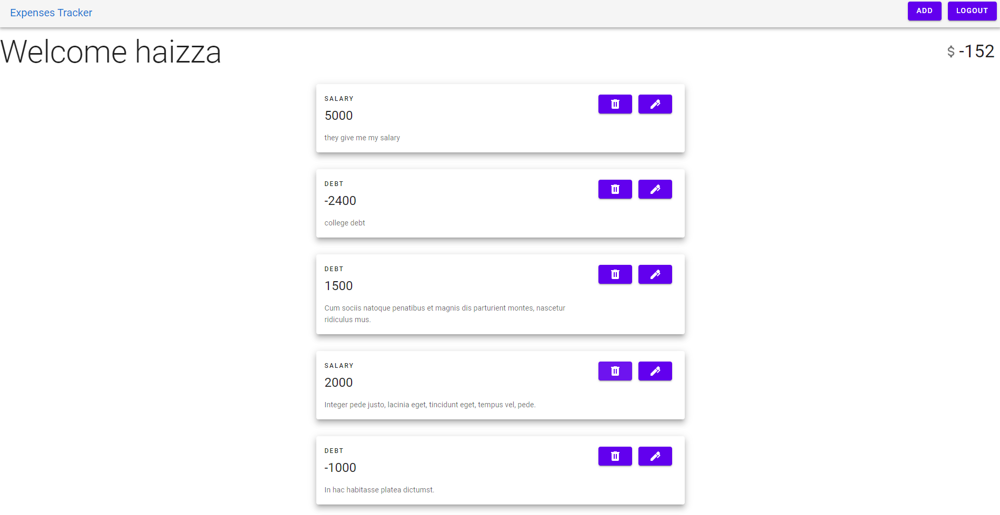

# Expense Tracker

app for track your finances and have a healthy finance.


## What is this?
this can be call a personal project for put in practice all that i learn in the past weeks
principal go, frontend development and typescript. also make an app that can be usefull in some cases
and help people to have a healthy finance with this app.

## Technologies use in this project:
Backend:
* Golang
* Echo
* Gorm
* MailSlurp
* Postgresql
* Redis

Frontend:
* TypeScript
* Svelte
* Routify
* Svelte Materialify

## Usage
To run locally you will need to have Postgresql, Redis, go and yarn install on you machine if you don't know how to install all this check this links:
* [Install Postgres](https://www.postgresqltutorial.com/install-postgresql/)
* [Install Redis](https://redisson.org/articles/how-to-install-redis.html)
* [Install Go](https://golang.org/doc/install)
* [Install Yarn](https://classic.yarnpkg.com/en/docs/install/#windows-stable)

first clone the repo   
```
$ git clone https://github.com/Haizza1/Expenses-tracker.git
```

### Backend set up
first check the .env.example in the server directory and set the env variables

```
DATABASE_URL=postgresql://<username>:<password>@localhost:5432/<db name>

REDIS_ADDRS=localhost:<redis port>

REDIS_PWD=<your redis password> // if you dont set a password just leaved blank

CORS_ORIGIN=http://localhost:5000

SESSION_SECRET=wiejfowfjsd

PORT=1323
```

know its time to run the app:
```
$ go build -o main

$ ./main
```

you should se something like this:

```
  ____    __
  / __/___/ /  ___
 / _// __/ _ \/ _ \
/___/\__/_//_/\___/ v4.2.1
High performance, minimalist Go web framework
https://echo.labstack.com
____________________________________O/_______
                                    O\
⇨ http server started on [::]:1323
```

### Frontend set up

go to the web folder and run:

```
$ yarn

$ yarn dev
```

with this you have set up the app localy!

## Feedback

Should you like to provide any feedback, please open up an Issue, I appreciate feedback and comments.
